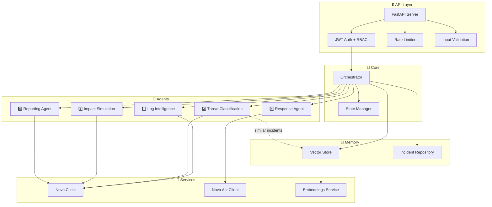

# 🛡️ Nova Autonomous Cyber Defense Commander

> A modular, multi-agent AI cybersecurity system powered by **Amazon Nova** that ingests logs, detects anomalies, classifies threats, simulates impact, executes defensive actions, and generates reports — all autonomously.


---

## 🏗️ Architecture



### Pipeline Flow

```
Raw Logs → Log Intelligence → Vector Memory Lookup → Threat Classification
         → Impact Simulation → Response (confidence-gated) → Reporting
         → Memory Storage (for future learning)
```

---

## 📦 Project Structure

```
├── main.py                          # FastAPI entry point
├── config/
│   └── settings.py                  # Pydantic settings from .env
├── core/
│   ├── agent_base.py                # Abstract BaseAgent class
│   ├── orchestrator.py              # Central pipeline controller
│   ├── state_manager.py             # Per-incident state tracking
│   └── exceptions.py                # Custom exception hierarchy
│   └── trace_dashboard.py           # Console trace renderer
├── agents/
│   ├── log_intelligence_agent.py    # Anomaly detection
│   ├── threat_classification_agent.py  # Threat categorization
│   ├── impact_simulation_agent.py   # What-if analysis
│   ├── response_agent.py           # Automated defensive actions
│   └── reporting_agent.py          # Report generation
├── events/                          # ⚡ Event-driven layer
│   ├── event_models.py              # LogEvent, IncidentTriggerEvent
│   ├── event_queue.py               # Async queue with backpressure
│   └── log_streamer.py              # Async log tailing + feed()
├── realtime/                        # 🔍 Realtime analysis
│   ├── sliding_window_engine.py     # Per-IP rolling deque + scoring
│   ├── ip_state_tracker.py          # Per-IP state + cooldown
│   └── threshold_engine.py          # Score evaluation + Nova trigger
├── enforcement/                     # 🚫 Sandbox enforcement
│   ├── sandbox_firewall.py          # In-memory IP block registry
│   └── block_manager.py             # Bridges orchestrator → firewall
├── daemon/                          # 🛡️ Daemon service
│   ├── daemon_service.py            # NovaSentinelDaemon main class
│   ├── lifecycle.py                 # Startup/shutdown management
│   └── worker_manager.py            # Background task supervision
├── monitoring/                      # 📊 Observability
│   └── metrics_collector.py         # Real-time counters + snapshot
├── memory/
│   ├── vector_store.py             # Semantic similarity search
│   └── incident_repository.py     # Incident persistence
├── services/
│   ├── nova_client.py              # Amazon Nova reasoning API
│   ├── nova_act_client.py          # Nova Act automation
│   └── embeddings_service.py       # Text embeddings
├── security/
│   ├── auth.py                     # JWT + RBAC
│   ├── rate_limiter.py             # Token-bucket rate limiter
│   └── validation.py              # Input sanitization
├── api/
│   ├── routes.py                   # REST endpoints
│   └── schemas.py                  # Pydantic models
├── demo/
│   ├── synthetic_logs.py           # Realistic attack log generators
│   └── demo_runner.py              # Full demo script
├── tests/
│   ├── test_agents.py              # Agent unit tests
│   ├── test_orchestrator.py        # Pipeline integration tests
│   ├── test_security.py            # Auth & validation tests
│   ├── test_memory.py              # Memory system tests
│   └── test_realtime.py            # Daemon & realtime tests (36 tests)
├── requirements.txt
└── .env.example
```

---

## 🛡️ Nova Sentinel — Event-Driven Daemon

Nova Sentinel transforms the system from request-driven API to a **continuous, real-time security daemon** that autonomously detects and blocks threats in seconds.

### Architecture

```
LogStreamer → EventQueue → Consumer → SlidingWindowEngine
                                            ↓
                                    ThresholdEngine (score crosses threshold?)
                                            ↓ YES
                                    Orchestrator (Nova multi-agent pipeline)
                                            ↓
                                    BlockManager → SandboxFirewall
                                            ↓
                                    MetricsCollector → GET /realtime/status
```

### Run Modes

| Mode | Command | Description |
|------|---------|-------------|
| `api` | `python main.py` | REST API only (default) |
| `daemon` | `RUN_MODE=daemon python main.py` | Standalone daemon |
| `hybrid` | `RUN_MODE=hybrid python main.py` | FastAPI + daemon |
| `simulate` | `RUN_MODE=daemon python main.py --simulate` | Live attack demo |

### Daemon Configuration

| Variable | Default | Description |
|----------|---------|-------------|
| `RUN_MODE` | `api` | `api`, `daemon`, or `hybrid` |
| `REALTIME_WINDOW_SECONDS` | `60` | Sliding window size |
| `FAILED_ATTEMPT_THRESHOLD` | `5` | Failures before Nova triggers |
| `BLOCK_DURATION_SECONDS` | `600` | IP block TTL |
| `MAX_NOVA_CALLS_PER_MINUTE` | `10` | Nova call rate limit |
| `EVENT_QUEUE_MAX_SIZE` | `10000` | Queue backpressure cap |
| `LOG_SOURCES` | `""` | `path:name,...` log files |

### Live Simulation

```bash
set RUN_MODE=daemon
python main.py --simulate
```

This simulates a brute-force SSH attack, showing the sliding window fill up, the suspicion score climbing, the threshold crossing, Nova activation, and the sandbox block being applied — all in real-time.

---

## 🚀 Quick Start

### 1. Install Dependencies

```bash
cd Amazon_Nova
pip install -r requirements.txt
```

### 2. Configure Environment

```bash
cp .env.example .env
# Default settings enable Demo Mode — no API keys needed
```

### 3. Start the Server

```bash
python main.py
# Server starts at http://localhost:8000
```

### 4. Run the Demo

```bash
# Option A: CLI demo (no server needed)
python -m demo.demo_runner

# Option B: API demo
# 1. Get a token
curl -X POST http://localhost:8000/auth/token \
  -H "Content-Type: application/json" \
  -d '{"username": "admin", "password": "admin"}'

# 2. Run demo pipeline
curl -X POST http://localhost:8000/demo \
  -H "Authorization: Bearer <your-token>"
```

---

## 📊 API Endpoints

| Method | Endpoint | Auth | Description |
|--------|----------|------|-------------|
| `GET` | `/health` | — | Health check |
| `POST` | `/auth/token` | — | Login, get JWT |
| `POST` | `/analyze-log` | Admin | Run full pipeline |
| `GET` | `/incident/{id}` | Any | Get incident details |
| `GET` | `/incidents` | Any | List all incidents |
| `POST` | `/simulate` | Admin | Impact simulation |
| `POST` | `/demo` | Admin | Run demo with synthetic logs |

Interactive docs: `http://localhost:8000/docs`

---

## 🔐 Security Features

- **JWT Authentication** with configurable expiry
- **Role-Based Access Control** (Admin / Viewer)
- **Token-Bucket Rate Limiting** (configurable RPM)
- **Input Validation** with max payload size enforcement
- **Prompt Injection Detection** (9 regex patterns)
- **Confidence-Gated Actions** — only executes when confidence ≥ 85% (configurable)
- **Full Audit Logging** of every automated action
- **Fail-Safe Design** — defers to human review when uncertain

---

## 🎯 Confidence-Based Action Logic

```python
if confidence_score >= CONFIDENCE_THRESHOLD (default 85%):
    → Execute automated response (block IP, disable user, etc.)
else:
    → Flag for human review, log decision, defer actions
```

The threshold is configurable via the `CONFIDENCE_THRESHOLD` environment variable.

---

## 🧠 Nova Integration Points

| Component | Integration | Purpose |
|-----------|-------------|---------|
| Log Intelligence | **Nova Reasoning** | Deep log pattern analysis |
| Threat Classification | **Nova Reasoning** | Threat attribution with explanation |
| Impact Simulation | **Nova Reasoning** | What-if scenario generation |
| Response Agent | **Nova Act** | Automated defensive actions |
| Reporting Agent | **Nova Reasoning** | Natural language report generation |
| Embeddings Service | **Nova Titan** (pluggable) | Incident similarity search |

In **Demo Mode**, all Nova calls return realistic mock responses, enabling full offline demonstration.

---

## 🧪 Testing

```bash
# Run all tests
python -m pytest tests/ -v

# Run specific suites
python -m pytest tests/test_agents.py -v
python -m pytest tests/test_orchestrator.py -v
python -m pytest tests/test_security.py -v
python -m pytest tests/test_memory.py -v
```

---

## ☁️ AWS Deployment

### Lambda + API Gateway

```bash
pip install mangum
# Add to main.py:
# from mangum import Mangum
# handler = Mangum(app)
```

### ECS / Fargate

```dockerfile
FROM python:3.11-slim
WORKDIR /app
COPY requirements.txt .
RUN pip install --no-cache-dir -r requirements.txt
COPY . .
EXPOSE 8000
CMD ["uvicorn", "main:app", "--host", "0.0.0.0", "--port", "8000"]
```

### Environment Variables

Set all variables from `.env.example` in your deployment environment. For production:
- Set `DEMO_MODE=false`
- Configure `NOVA_API_KEY` and `NOVA_ACT_ENDPOINT`
- Change `JWT_SECRET` to a strong random string
- Update admin credentials

---

## 🏆 Hackathon Demo Script (3 minutes)

1. **Start server** → Show health check *(15 sec)*
2. **Explain architecture** → Show the Mermaid diagram *(30 sec)*
3. **Login** → Get JWT token *(15 sec)*
4. **Run demo** → `POST /demo` — show 3 attack scenarios *(60 sec)*
5. **Show incident** → `GET /incident/{id}` — show full pipeline output *(30 sec)*
6. **Highlight key features**: confidence gating, vector memory, audit log *(30 sec)*

---

## 4.2 Production Configuration

The system is now fully integrated with **Amazon Nova 2** and **Nova Act** for production use.

### Enable Real Nova Reasoning (Bedrock)

1.  **Install dependencies**:
    ```bash
    pip install boto3
    ```

2.  **Set environment variables**:
    ```bash
    ENABLE_PRODUCTION_MODE=true
    DEMO_MODE=false
    NOVA_REGION=us-east-1
    NOVA_MODEL_ID=amazon.nova-pro-v1:0
    ```

3.  **AWS Credentials**:
    Ensure `~/.aws/credentials` or standard AWS env pars (`AWS_ACCESS_KEY_ID`, `AWS_SECRET_ACCESS_KEY`) are set. The system uses specific Bedrock Runtime permissions.

### Enable Real Nova Act Automation

1.  **Install SDK**:
    Ensure the `nova-act` SDK is installed in your environment (if available via private preview or public package).

2.  **Configure**:
    ```bash
    NOVA_ACT_ENDPOINT=https://nova-act-api.amazonaws.com/...
    NOVA_ACT_API_KEY=your-api-key
    ```
    
    *Note: If the SDK is not found, the system will gracefully log an error and skip execution but keep the pipeline running.*

### Enable Real Amazon Titan Embeddings

1.  **Configure**:
    ```bash
    VECTOR_DIMENSION=1024  # Titan v2 default
    ```
    
    The system automatically switches from hash-based embeddings to `bedrock-runtime` invoke_model(`amazon.titan-embed-text-v2:0`) when `DEMO_MODE=false`.

---

## 5. Daemon Architecture
